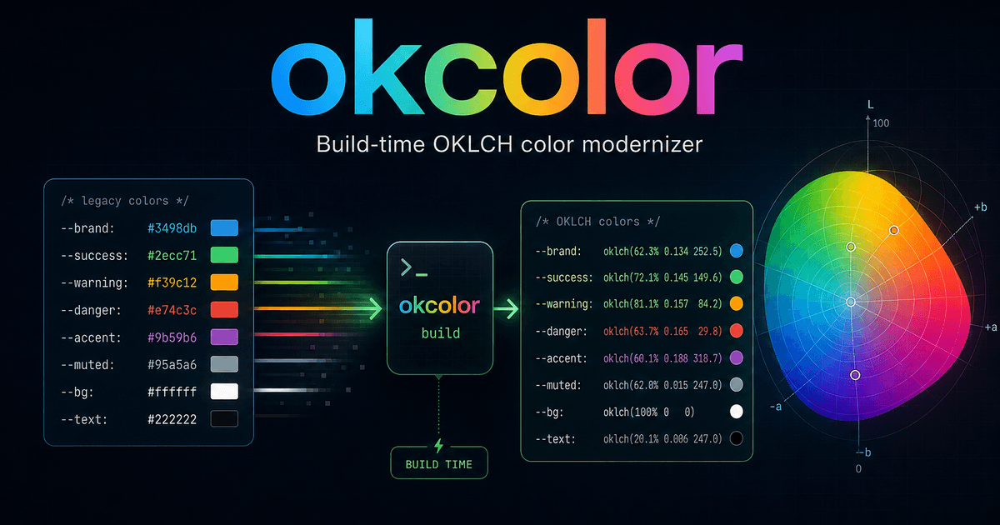

# okcolor

[](https://www.npmjs.com/package/@tonybonet/okcolor)
[](LICENSE)



Frontend-first, build-time color modernizer for **Vite** and Vite-based frameworks. Converts legacy Hex, RGB, HSL, HWB, and named colors to perceptually uniform **OKLCH** during your build. The normal app path has zero runtime overhead and ships no okcolor runtime code.

- **Vite-first DX** — drop in `okColor()` and modernize app CSS without runtime code
- **Rust/WASM engine** — ~166 KB npm package, ~225 KB optimized WASM
- **Standards-aligned OKLCH conversion** — based on Ottosson 2020 and CSS Color 4
- **Idempotent** — second pass is a no-op
- **Cache** — 4096-slot direct-mapped: `#ff0000`, `rgb(255,0,0)`, and `red` hit the same slot
- **Framework-aware scanning** — handles Vite virtual CSS modules, Vue/Astro/Svelte-style embedded styles, symlinked CSS trees, and CSS escape edge cases
- **Token compiler** — converts sRGB design tokens into fallback-first CSS with optional Display P3 OKLCH expansion
- **Pair-based contrast reports** — audits declared foreground/background token pairs for WCAG 2 in both fallback and P3 targets, defaulting to AA with build-time overrides for AAA or custom ratios
- **Tree-shakeable entry points** — the Vite/plugin path, Node core API, and optional browser adapter are split so browser tooling is not pulled into normal builds

## Why okcolor?

The web is modernizing. Design tokens are shifting from Hex and `rgb()` to perceptually uniform spaces like **OKLCH** and **Oklab** — spaces where lightness maps to what humans actually see, where interpolation doesn't turn muddy, and where gamut boundaries make sense.

AI agents still emit Hex. Most color pickers still default to `#`. Established workflows are built on decades of sRGB hex codes. And that's fine — Hex is human-readable, compact, and universal. But when you're targeting modern displays (Display P3, Rec2020) with wider gamuts and extended ranges, Hex locks you into sRGB.

okcolor breaks that lock. Write your colors however you want — **Hex**, **RGB**, **HSL**, **HWB**, named, modern — and okcolor converts them to **OKLCH at build time**. Work in the space that makes sense for your intent, then compile to modern CSS. Zero runtime cost, zero lock-in.

## Compared to alternatives

| Feature                                   | okcolor | Culori | color.js | PostCSS |
| ----------------------------------------- | ------- | ------ | -------- | ------- |
| Hex → OKLCH                               | ✓       | ✓      | ✓        | —       |
| RGB/HSL/HWB → OKLCH                       | ✓       | ✓      | ✓        | —       |
| Named colors → OKLCH                      | ✓       | ✓      | ✓        | —       |
| Full CSS parse (comments, strings, var()) | ✓       | ✗      | ✗        | ✓       |
| color-mix() pass-through                  | ✓       | ✗      | ✓        | ✓       |
| light-dark() pass-through                 | ✓       | ✗      | ✓        | —       |
| Display-P3 / Rec2020 pass-through         | ✓       | ✓      | ✓        | ✓       |
| Vite SFC virtual CSS modules              | ✓       | ✗      | ✗        | ✓       |
| Embedded Vue/Astro/Svelte styles          | ✓       | ✗      | ✗        | ✓       |
| Symlink-safe CLI traversal                | ✓       | ✗      | ✗        | —       |
| auto-detect legacy colors                 | ✓       | ✗      | ✗        | —       |
| oklch-ignore escape hatch                 | ✓       | ✗      | ✗        | —       |
| Build-time only (zero runtime)            | ✓       | ✗      | ✗        | ✓       |
| CLI with audit / check / scope            | ✓       | ✗      | ✗        | —       |
| Token JSON → layered CSS                  | ✓       | ✗      | ✗        | —       |
| P3 chroma expansion from OKLCH identity   | ✓       | ✗      | ✗        | —       |
| Pair-based WCAG token contrast reports    | ✓       | ✗      | ✗        | —       |
| WASM engine                               | ✓       | ✗      | ✗        | —       |
| 4096-slot color cache                     | ✓       | ✗      | ✗        | —       |
| Idempotent (no-op on modern CSS)          | ✓       | ✗      | ✗        | —       |

## Install

```bash
npm install -D @tonybonet/okcolor
pnpm add -D @tonybonet/okcolor
bun add -D @tonybonet/okcolor
```

## Usage

### Vite and Vite frameworks

```ts
// vite.config.ts
import { defineConfig } from 'vite'
import { okColor } from '@tonybonet/okcolor'

export default defineConfig({
  plugins: [
    okColor({
      input: 'src/tokens/colors.json',
      output: 'src/styles/colors.css',
      reportPath: 'okcolor.report.json',
      audit: {
        failOn: ['wcag2-regression'],
        wcag2: { level: 'aa' },
      },
    }),
  ],
})
```

Works with Vite, Astro, SvelteKit, Nuxt, Remix Vite, SolidStart, Qwik, Vue, React, and vanilla Vite apps.

### CLI

```bash
# Audit color debt
npx @tonybonet/okcolor audit ./src
npx @tonybonet/okcolor audit ./src --format=json

# CI gate
npx @tonybonet/okcolor check ./src --max-legacy-colors=10

# Diagnose issues
npx @tonybonet/okcolor scope ./src

# Convert a single color
npx @tonybonet/okcolor convert "#ff5a00" --to oklch

# Compile color tokens with P3 enhancement
npx @tonybonet/okcolor expand ./tokens.json --gamut p3 --amount 0.75 --out ./colors.css --report ./okcolor.report.json

# Explain available chroma headroom
npx @tonybonet/okcolor describe "#ff5a00" --gamut p3
```

### Advanced: programmatic Node API

Most frontend apps do not need this. Use it for build scripts, custom tooling, or adapters outside Vite.

```ts
import { transformCss, auditCss } from '@tonybonet/okcolor/core'

const result = transformCss(`
  .btn { color: #ff0000; }
`)
// .btn { color: oklch(62.8% 0.25768 29.23); }

const stats = auditCss(source)
console.log(stats.legacy_count) // number of legacy colors
```

### Advanced: browser UI adapter

Use this only when you intentionally ship a color picker, inspector, playground, or docs demo. Build-time Vite usage remains the recommended app path.

```ts
import { colorToOklch, initOkColorBrowser, transformCss } from '@tonybonet/okcolor/browser'

await initOkColorBrowser()

console.log(colorToOklch('#ff5a00'))
console.log(transformCss('.btn { color: #ff5a00; }'))
```

### Token compiler

```json
{
  "color.action.primary.bg": {
    "$type": "color",
    "$value": "#0055ff",
    "okcolor": {
      "text": "color.action.primary.fg",
      "contrast": "wcag2-aa"
    }
  },
  "color.action.primary.fg": "#ffffff"
}
```

```bash
npx @tonybonet/okcolor expand ./tokens.json --gamut p3 --amount 0.75 --out ./colors.css --report ./okcolor.report.json
```

The generated CSS keeps sRGB fallback values first, then emits guarded Display P3 OKLCH overrides. The report audits declared foreground/background pairs separately for fallback and P3 output.

## Examples

| Input                        | Output                                                                               |
| ---------------------------- | ------------------------------------------------------------------------------------ |
| `#ff0000`                    | `oklch(62.8% 0.25768 29.23)`                                                         |
| `rgb(255, 0, 0)`             | `oklch(62.8% 0.25768 29.23)`                                                         |
| `hsl(0, 100%, 50%)`          | `oklch(62.8% 0.25768 29.23)`                                                         |
| `hwb(0 0% 0%)`               | `oklch(62.8% 0.25768 29.23)`                                                         |
| `red`                        | `oklch(62.8% 0.25768 29.23)`                                                         |
| `linear-gradient(red, blue)` | `linear-gradient(in oklch, oklch(62.8% 0.25768 29.23), oklch(45.2% 0.31321 264.05))` |

Modern colors (`oklch()`, `oklab()`, `color(display-p3 ...)`, `color-mix()`, `light-dark()`) pass through untouched.

## What gets transformed

okcolor is intentionally conservative: it transforms legacy colors only where CSS grammar says a color is plausible.

Supported:

- Raw CSS declaration snippets: `color: red;`
- Rules and nested rules: `.btn { color: #f00; }`
- CSS custom properties, including escaped names: `--\31 brand: red;`
- Color-capable shorthands: `background`, `border`, `outline`, `box-shadow`, `text-shadow`, `text-decoration`, `text-emphasis`, `text-stroke`, SVG `fill`/`stroke`, and related `*-color` properties
- `@supports` declaration conditions: `@supports (color: red) { ... }`
- `@container style(...)` queries
- `@property` color registrations: `@property --brand { syntax: "<color>"; initial-value: red; }`
- `@page` margin boxes: `@page { @top-left { color: red; } }`
- Gradients, including multiline gradients and SCSS/Less-style `//` comments
- Vite virtual style modules such as `Component.vue?vue&type=style&lang.css`
- Embedded `<style>` blocks in Vue/Astro/Svelte-like files

Preserved:

- Selectors and selector functions: `:is(a:hover #abc, .red)`
- `@supports selector(...)` arguments
- Identifier-only properties such as `animation-name`, `font-family`, `grid-area`, `container`, `scroll-timeline`, `counter-reset`, and `view-transition-name`
- Modern color syntax: `oklch()`, `oklab()`, `lab()`, `lch()`, `color-mix()`, `light-dark()`, relative colors such as `rgb(from red r g b)`, and non-sRGB `color(...)`
- URLs, strings, comments, and ignored lines

## Escape hatch

```css
.retro-badge {
  background-color: #ff0000; /* oklch-ignore */
}
```

You can also provide a custom ignore marker through the JS API. okcolor shields that marker internally with a private sentinel, so unrelated `oklch-ignore` text in strings or content is not rewritten.

## Benchmarks

Latest local benchmark run:

| Metric                           | Result                      |
| -------------------------------- | --------------------------- |
| Transform, 1.3 KB CSS            | ~17,239 ops/sec             |
| Transform, 12 KB CSS             | ~1,333 ops/sec              |
| Transform, 100 KB CSS            | ~230 ops/sec                |
| Audit, 100 KB CSS                | ~349 ops/sec                |
| Whole-file transform vs color.js | ~2.1× faster in this run    |
| Fast path, no legacy colors      | ~7,212 ops/sec on 50 KB CSS |
| Optimized WASM payload           | ~225 KB                     |
| npm package dry-run              | ~166 KB, 27 files           |

Benchmarks are workload-sensitive. Run them on your machine:

```bash
npm run bench
```

Measured locally on Windows, Node.js 26. The full pipeline (scan, parse, gamma decode, matrix, cache, format) runs in a single WASM-backed pass. okcolor prioritizes correctness around CSS comments, strings, selectors, gradients, embedded styles, and Vite virtual modules; raw micro-benchmarks against libraries that do not scan full CSS are not apples-to-apples.

## Development

```bash
npm test
npm run lint
cargo fmt --manifest-path packages/core-wasm/Cargo.toml --check
cargo clippy --manifest-path packages/core-wasm/Cargo.toml -- -D warnings
npm run build
npm pack --dry-run
```

On Windows, if native Rust tests fail with Visual Studio `link.exe` error `0xc0000017`, use LLVM's linker:

```powershell
$env:CARGO_TARGET_X86_64_PC_WINDOWS_MSVC_LINKER = "rust-lld"
cargo test --manifest-path packages/core-wasm/Cargo.toml
```

That runs the Rust unit suite without relying on a broken Visual Studio linker install.

## Documentation

Full docs and interactive playground: **[tonyblu331.github.io/okcolor](https://tonyblu331.github.io/okcolor)**

## License

okcolor is released under the [MIT License](LICENSE).

MIT &copy; Antonio Bonet
