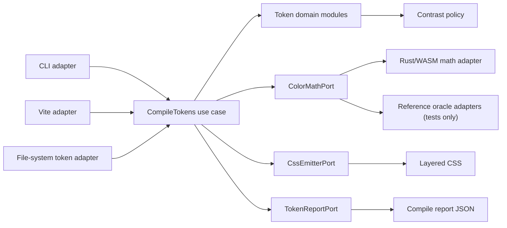
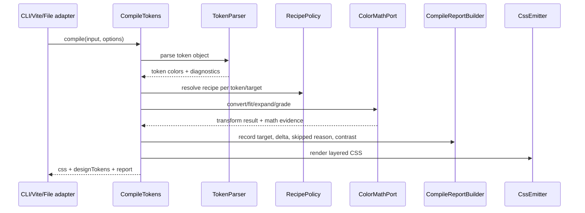

# Color Math Research Hardening — Technical Design

## Design decisions

### D1 — OKLCH is the v1 operational color model

**Decision:** Keep OKLCH/OKLab as the v1 manipulation space for SDR web colors.

**Rationale:** CSS Color 4 defines OKLab/OKLCH syntax and gamut mapping for SDR CSS
colors. Its RGB gamut mapping algorithms aim at constant-lightness, constant-hue chroma
reduction in OKLCH. This aligns with okcolor's current `fit`, `expand`, and `cMax`
direction.

**Tradeoff:** OKLCH is not a universal color appearance model. It is good for the web SDR
scope, not a proof for HDR, print, or all viewing conditions.

### D2 — WCAG 2.2 is the compliance gate; APCA is advisory

**Decision:** Keep WCAG 2.2 contrast ratio as the blocking compliance gate. Keep APCA
as advisory report metadata only.

**Rationale:** WCAG 2.2 defines the current normative contrast ratio gate. WCAG 3 remains
a draft and states that its contrast algorithm is not yet determined.

### D3 — CAM16/JzAzBz are research-track, not v1 product core

**Decision:** Use CAM16/JzAzBz papers and CIE material to inform future work, but do not
implement them in the v1 core without a separate SDD change and oracle fixtures.

**Rationale:** CIECAM16 is viewing-condition-aware and valuable for color management.
JzAzBz is relevant to HDR/WCG perceptual uniformity. Both increase domain complexity and
would be irresponsible glue if added before okcolor's OKLCH path is oracle-backed.

### D4 — External color libraries are test oracles, not production dependencies

**Decision:** Color.js and ColorAide may be used in tests/scripts to validate behavior.
They MUST NOT become production runtime dependencies unless a later proposal justifies
the size/DX tradeoff.

### D5 — `contrastLock` is a pair invariant, not a hidden color solver

**Decision:** Design `contrastLock` as an explicit contrast invariant over declared token
pairs. In v1, the compiler MUST NOT silently mutate unrelated hue/chroma/lightness values
to "make contrast pass." If a generated target breaks the configured WCAG 2 AA pair, the
report records the failing pair and the CI gate blocks when `wcag2-regression` is enabled.

**Rationale:** Automatic contrast repair sounds helpful, but it hides a product decision:
which token should move, how much visual identity may change, and whether the change is
allowed per target gamut. That belongs in an explicit future solver design, not inside
the token compiler's current transform path.

**Semantics for implementation:**

- `contrastLock` applies only to declared pairs (`okcolor.text`), not every incidental
  color combination in a design system.
- The lock is evaluated per output target (`srgb`, `p3`, etc.) because a P3 transform can
  pass or fail independently from the fallback.
- WCAG 2 AA remains the blocking predicate. APCA may be reported beside it, but MUST NOT
  unlock or block a pair by itself.
- Missing foreground/background tokens are reportable pair-level skips, not passes.
- If a future repair mode is added, it must be a separate strategy with its own report
  fields, oracle fixtures, and visual-delta constraints.

## Target architecture

## Deepening candidates

### 1. Token compile use case

- **Files:** `src/token/compiler.ts`, `src/token/types.ts`
- **Problem:** One module owns parsing, recipe resolution, transforms, CSS rendering,
  contrast, reports, and IO.
- **Solution:** Extract a `CompileTokens` application use case that orchestrates deep
  domain modules without owning their details.
- **Benefits:** Better locality for compile behavior and a smaller test surface for CLI,
  Vite, and file-system adapters.

### 2. Token parser and diagnostics module

- **Files:** `src/token/compiler.ts`, future `src/token/parser.ts`,
  `src/token/diagnostics.ts`
- **Problem:** Unsupported tokens are silently skipped when `extractTokenColor` returns
  `undefined`.
- **Solution:** A parser module should return either a valid token color or a structured
  diagnostic with path, reason, and severity.
- **Benefits:** No silent user failures; JSON reports can explain skipped/malformed tokens.

### 3. Recipe policy module

- **Files:** `src/token/transforms.ts`, `src/token/compiler.ts`
- **Problem:** Recipe resolution and recipe behavior are split across orchestration and
  transform code.
- **Solution:** A `RecipePolicy` module owns recipe validation, built-in aliasing, default
  amounts, and "taste preset" disclaimers.
- **Benefits:** Recipes become explicit product policy, not hidden transform glue.

### 4. Report builder module

- **Files:** `src/token/compiler.ts`, `src/token/contrast.ts`, `src/types.ts`
- **Problem:** Report shape is assembled inline during compile.
- **Solution:** A `CompileReportBuilder` owns target summaries, deltas, skipped reasons,
  contrast results, and failure collection.
- **Benefits:** The report contract becomes the test surface. CLI/Vite can consume it
  without knowing compiler internals.

### 5. Color math port

- **Files:** `src/token/transforms.ts`, `src/wasm.ts`, `packages/core-wasm/src/gamut.rs`
- **Problem:** Product transforms call WASM functions directly.
- **Solution:** Define a `ColorMathPort` interface in the token/application layer. The
  production adapter delegates to Rust/WASM; test adapters compare W3C/Color.js/ColorAide
  oracle results.
- **Benefits:** Real seam because there will be at least two adapters: production WASM and
  reference oracle tests.

## Sequence: future token compile after deepening

## Verification strategy

1. Add oracle fixture files before production math changes.
2. Keep tolerances explicit and source-cited.
3. Snapshot report JSON shape.
4. Add mutation-style tests for malformed/unsupported tokens.
5. Keep APCA advisory assertions separate from WCAG blocking assertions.
