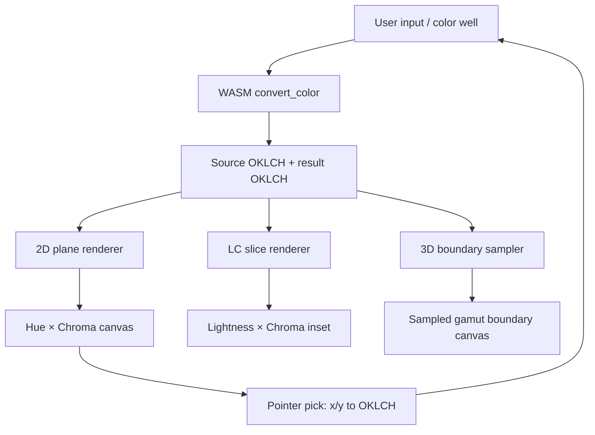

# Converter Gamut Visualization Rebuild — Technical Design

## Research lessons to preserve

### R1 — Real pickers use planes, not decorative polar blobs

The strongest OKLCH picker references show rectangular 2D graph planes:

- hue × chroma at fixed lightness,
- lightness × chroma at fixed hue,
- lightness × hue or chroma × hue inspection depending on control.

This matches Eero Lehtinen's shader approach: fragment shaders sample OKLCH coordinates
per pixel and make invalid/out-of-gamut pixels transparent or masked.

### R2 — Out-of-gamut is data, not decoration

Out-of-gamut areas should not be filled with plausible-looking color. They should be
masked, dimmed, or shown as unavailable. Björn Ottosson's gamut clipping diagrams make
the boundary explicit and show projection/intersection behavior.

### R3 — 3D must come from gamut boundary samples

Evil Martians' picker builds 3D geometry from RGB gamut-edge samples converted into
OKLCH and triangulated with Delaunator/three.js. For okcolor docs, the first rebuild can
use a Canvas2D-projected boundary point cloud or wire mesh, but the points MUST come from
real boundary sampling, not invented rings.

### R4 — Docs can sample, but must label sampling

This page is a learning tool, not a scientific plotting package. Sampling is acceptable
if the UI says it is sampled and if the shape is generated from the same gamut math used
by the converter.

## Design decisions

### D1 — Remove the current visual renderer instead of patching it

**Decision:** Treat the current 2D and 3D drawing functions as throwaway code.

**Rationale:** The previous renderer accumulated contradictory ideas: polar picker,
sampled square map, radial sweeps, and fake volume fill. Keeping it creates more
confusion than value.

### D2 — Use rectangular `ImageData` planes for 2D

**Decision:** Render 2D maps by iterating pixels over explicit OKLCH axes, converting each
sample to display CSS color, and masking unavailable samples.

Primary view:

```text
x axis: hue 0..360
y axis: chroma 0..CmaxView
fixed: lightness from current source/result
```

Secondary inspector:

```text
x axis: lightness 0..1
y axis: chroma 0..CmaxView
fixed: hue from current source/result
```

**Rationale:** This mirrors the researched picker mental model and avoids fake radial
geometry. It also gives users a true "palette" feel because every visible pixel maps to a
real OKLCH coordinate.

### D3 — Mask invalid/out-of-gamut samples before painting

**Decision:** A pixel is paintable only if the sampled OKLCH coordinate fits the selected
target gamut. Otherwise it is transparent/dimmed over a quiet grid.

**Rationale:** Users should see the reachable color field, not a synthetic fill beyond
the gamut boundary.

### D4 — Build 3D from sampled RGB boundary points

**Decision:** Generate 3D points by sampling RGB cube faces in the selected target gamut,
converting boundary RGB samples into OKLCH, projecting `(h, c, l)` into a simple 3D
camera, and depth-sorting before drawing.

Initial renderer:

- no new dependency,
- Canvas2D projection,
- point cloud plus optional nearest-neighbor/wire segments,
- orbit angle controlled by a slider or drag only if needed.

Escalation path:

- If the Canvas2D boundary cloud is not legible, add a docs-only `three` + `delaunator`
  implementation after a separate dependency review.

**Rationale:** Boundary sampling copies the important idea from serious implementations
without forcing a heavy 3D stack on the docs page immediately.

### D5 — Split renderer helpers out of the Astro markup

**Decision:** Keep WASM setup and UI binding in the component, but move rendering logic
into small pure functions inside the script or a dedicated helper module:

- `renderOklchPlane2d()`
- `renderLcSlice2d()`
- `buildGamutBoundarySamples()`
- `projectOklchPoint()`
- `renderGamutBoundary3d()`

**Rationale:** The visual layer needs tests and local reasoning. A single giant component
is why the old code dragged bad ideas forward.

## Proposed flow



## Rendering details

### 2D hue × chroma plane

For each pixel:

1. Convert `x` to hue.
2. Convert `y` to chroma.
3. Keep current lightness fixed.
4. Check `oklch_in_gamut(l, c, h, targetGamut)`.
5. If false, write transparent/disabled pixel.
6. If true, write `oklch(l c h)` converted by browser CSS or by a small OKLCH-to-sRGB
   helper for `ImageData`.

Preferred implementation uses JS color math for pixel writing to avoid per-pixel WASM
calls. WASM remains the authority for boundary checks and selected color conversion.

### 3D sampled boundary

Sample the six faces of the RGB cube:

```text
r = 0, r = 1
g = 0, g = 1
b = 0, b = 1
```

For each boundary RGB sample:

1. Convert from selected RGB space to OKLCH.
2. Store `{ l, c, h, rgb, face }`.
3. Project hue/chroma/lightness into 3D.
4. Sort by projected depth.
5. Draw small points or short face-neighbor segments.

The sampled shape is allowed to be approximate, but its source points must be real gamut
boundary points.

## Verification strategy

1. Add a renderer sanity test or script that checks:
   - center/low-chroma samples are paintable,
   - high-chroma samples beyond `oklch_chroma_max` are masked,
   - pointer picking maps x/y to expected hue/chroma ranges.
2. Run `npm run build:docs`.
3. Capture browser screenshots for:
   - 2D hue × chroma plane,
   - LC slice,
   - 3D boundary cloud,
   - mobile layout.
4. Compare screenshots against research reference checklist, not against the old page.

## Research reference checklist

- Looks like a tool/picker, not a decorative art panel.
- Invalid space is visibly unavailable.
- Axes are explicit.
- Current color marker is legible.
- 3D geometry reads as sampled boundary/volume, not flat colored sheets.
- No fake "P3 shape" claims unless derived from target gamut samples.
